# Lab9 - Introduction to cloud computing - AWS services

I used education account so from section `1` I skipped all steps except section `1.3`. Bellow I attach screens that confirms configuration were suecessful. Model files were uploaded to s3 bucket and then retrieved with [aws_utils.py](src/lab09_lib/aws_utils.py). Once retrieved, model files was copied by `COPY large_models ./large_models` command in [Dockerfile](Dockerfile)

## AWS Cli configuration
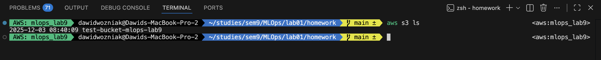

## Ecr repository with docker image pushed
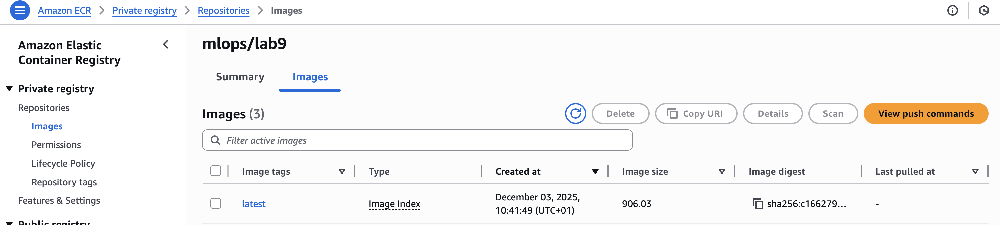

## Created subnets
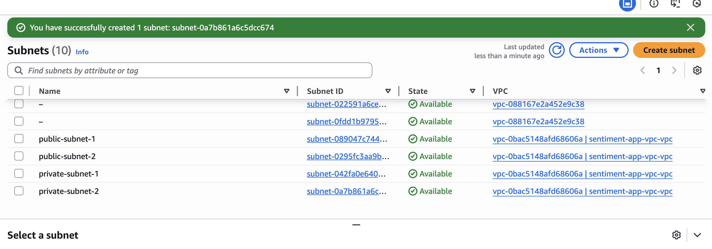

## Created VPC
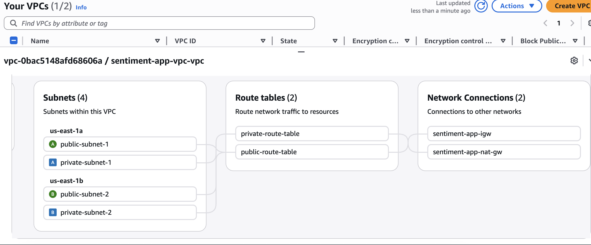

## Load Balancer Configuration

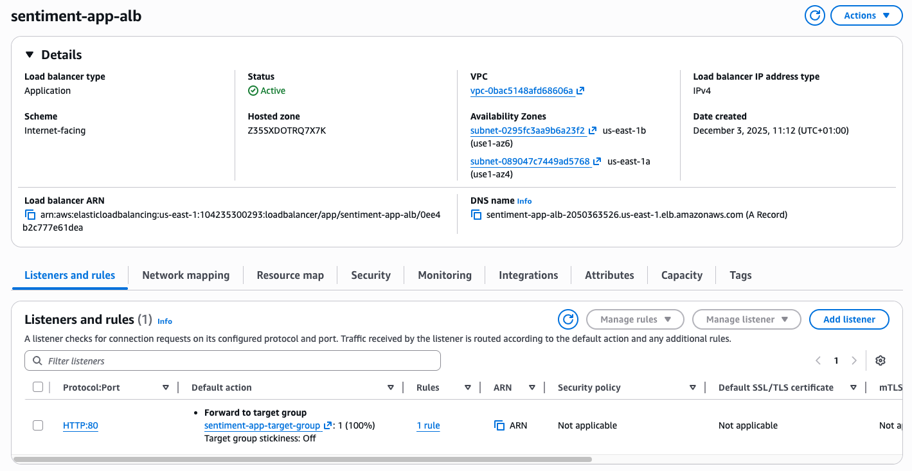
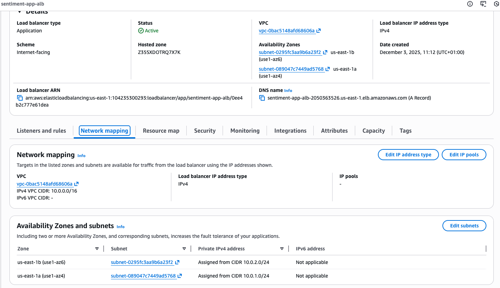
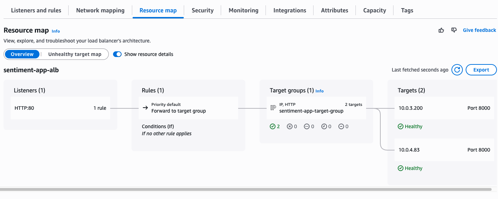

## Fargate Service with running tasks
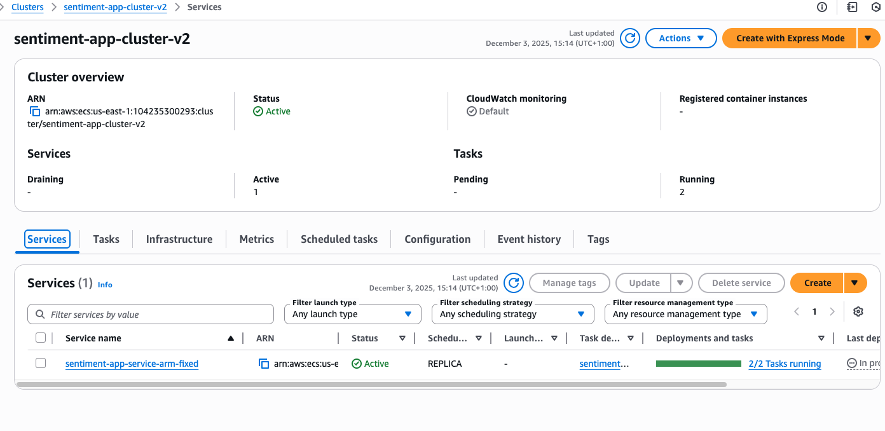

## Swagger UI in deployed Service
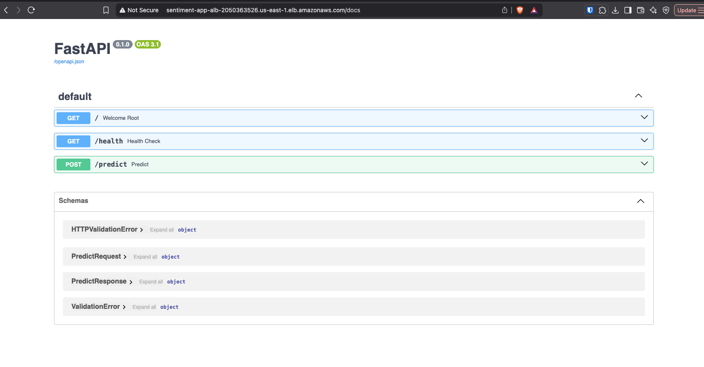

## Working Endpoint example
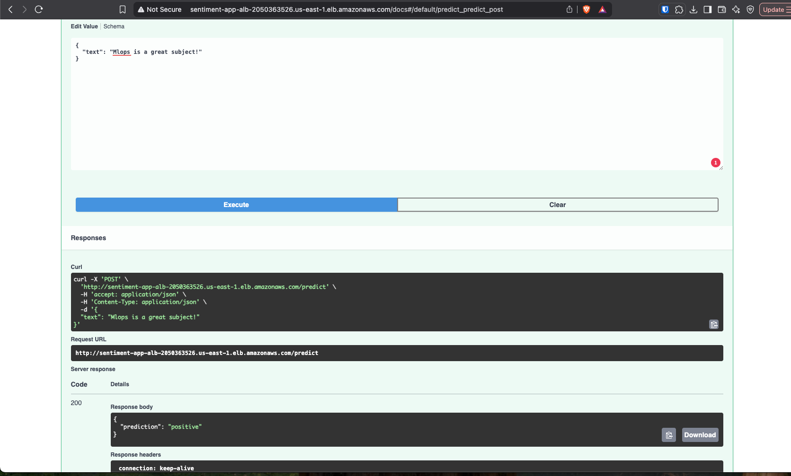

## Some metrics and logs

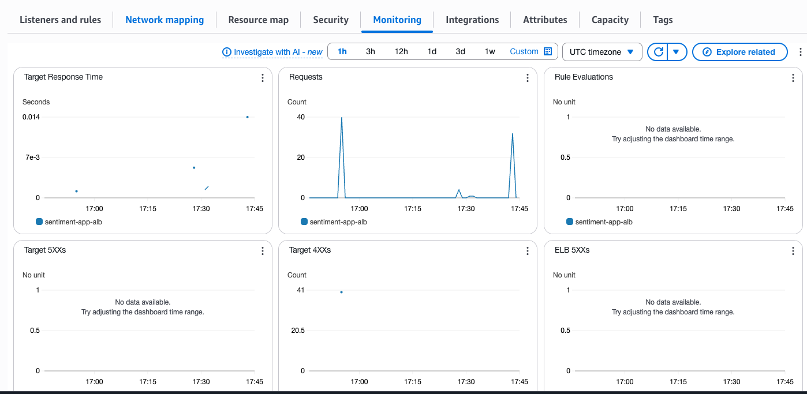

## Passed tests
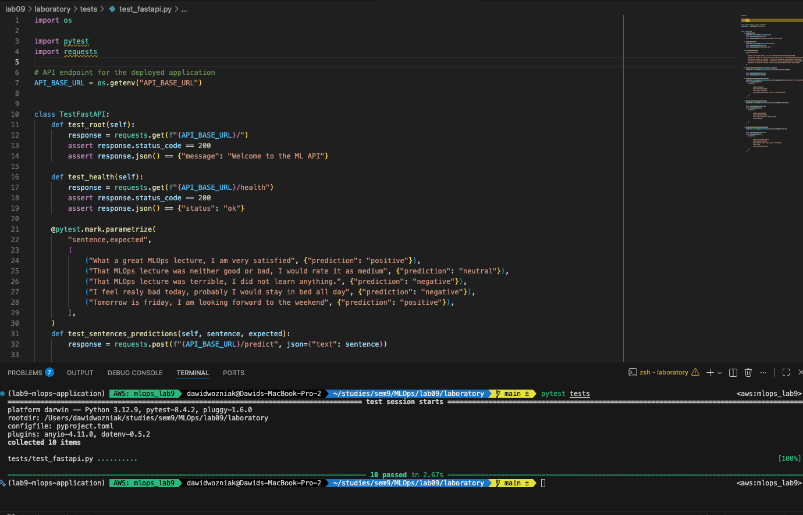

Tests were taken from `lab01` and adjusted to point to deployed API instead of local fastapi `TestClient`.